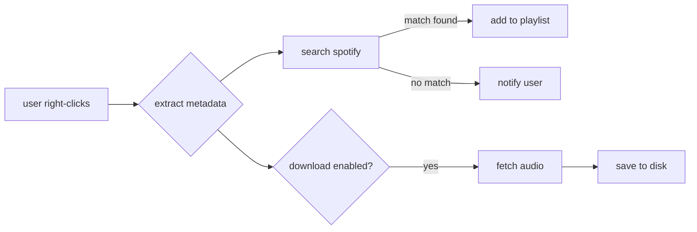

<div align="center">
  

  a chrome extension that syncs youtube videos to spotify playlists and downloads audio.

  [](LICENSE)
  [](package.json)

  <br/>

  
</div>

---

## quickstart

1. download the latest release from github.
2. unzip the archive.
3. open `chrome://extensions` and enable **developer mode**.
4. click **load unpacked** and select the unzipped folder.

## features

- **one-click sync**: adds youtube videos to spotify playlists via right-click context menu.
- **dual action**: downloads audio locally while syncing to spotify.
- **smart matching**: uses jaro-winkler similarity to match fuzzy titles.
- **source fallback**: tries lossless sources (lucida) first, falls back to youtube (cobalt).
- **client-side**: no backend server. authentication happens directly with spotify.

## how it works



1. content script extracts video title and channel from the active tab.
2. background service sanitizes the title (removes "official video", "lyrics", etc).
3. searches spotify api with multi-query fallback.
4. adds track to selected playlist if confidence score > 0.5.
5. downloads audio via cobalt or lucida api if enabled in settings.

## usage

### configuration

access settings via the popup gear icon.

```json
{
  "default_playlist": "ask every time",
  "quality": "mp3-320",
  "naming": "artist - title",
  "sources": ["cobalt", "lucida"]
}
```

### commands

- **right-click video**: opens context menu with playlist options.
- **popup click**: allows manual sync of current tab.

## project structure

```
tuneflow-extension/
├── src/
│   ├── background/    # service worker & api logic
│   ├── content/       # youtube dom scraper
│   ├── popup/         # react ui for extension
│   ├── settings/      # options page
│   └── services/      # spotify, cobalt, lucida integrations
├── scripts/           # build & package tools
└── assets/            # icons & static files
```

## license

mit.
