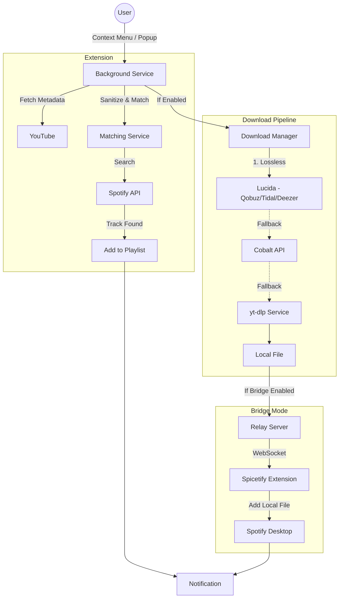

<p align="center">
  <a href="https://github.com/Microck/tuneport">
    
  </a>
</p>

<p align="center">a browser extension that syncs YouTube videos to Spotify playlists with zero friction.</p>

<p align="center">
  <a href="https://chromewebstore.google.com/detail/tuneport"></a>
  <a href="https://addons.mozilla.org/firefox/addon/tuneport-youtube-to-spotify-full/"></a>
  <a href="LICENSE"></a>
</p>

<p align="center">
  
</p>

---

## overview

tuneport bridges the gap between YouTube's discovery algorithm and Spotify's library management. it detects the video you're watching, finds the best match on Spotify, and adds it to your chosen playlist with a single click.

unlike other sync tools, tuneport also offers **simultaneous downloads**. it checks lossless sources (Qobuz, Tidal, Deezer) via Lucida before falling back to YouTube's audio stream, ensuring you always get the highest quality file for your local archive.

---

## installation

**recommended:**
- [chrome web store](https://chromewebstore.google.com/detail/tuneport) (pending review)
- [firefox add-ons](https://addons.mozilla.org/firefox/addon/tuneport-youtube-to-spotify-full/) (pending review)

**manual install:**
1. download the latest `tuneport-github-v*.zip` from [releases](https://github.com/Microck/tuneport/releases)
2. go to `chrome://extensions` (or `about:debugging` for firefox)
3. enable **developer mode**
4. drag and drop the zip file

**spotify setup:**
1. go to the [Spotify Developer Dashboard](https://developer.spotify.com/dashboard) and create a new application
2. find your redirect uri in the extension setup screen (e.g. `chrome-extension://<id>/popup/auth-callback.html`)
3. add this to your Spotify app settings and save
4. copy the `client id` from the dashboard and paste it into the extension

---

## features

-   **instant sync**: right-click any video -> "add to playlist".
-   **smart matching**: uses Jaro-Winkler fuzzy matching to handle "official video", "lyrics", and "ft." noise.
-   **YouTube Music fallback**: when Spotify match fails, tries YouTube Music metadata for better results (auto/ask/never modes).
-   **dual pipeline**: adds to Spotify + downloads to disk in parallel.
-   **segment downloads**: auto or manual ranges via yt-dlp. manual supports single-song cuts (merged) or multiple tracks. adds to Spotify when titles exist.
-   **lossless first**: prioritizes flac from Lucida (Qobuz/Tidal/Deezer); falls back to YouTube's native opus stream (~128kbps, perceptually equivalent to mp3 320kbps).
-   **custom quality presets**: create up to 5 custom download presets with format descriptions.
-   **duplicate guard**: checks destination playlist before adding to prevent clutter.
-   **privacy**: runs entirely in the browser. no backend server. no data collection.
-   **bridge automation**: relay + spicetify bridge for local file playlist adds.


---

## the "local files" problem

you want to click one button and have a youtube-only remix appear in your spotify playlist. i know. i want that too.
it is currently impossible to do this automatically with just a chrome extension.

### why it fails
spotify's web api explicitly blocks adding `local` files to playlists. you can only add tracks that exist in their cloud catalog. we tried everything:
- **api injection**: rejected by server (400 bad request).
- **file system manipulation**: chrome extensions are sandboxed and can't write to spotify's database.
- **spotilocal**: the old internal desktop bridge is dead/locked down.

### the workaround
tuneport does the next best thing:
1. it matches what it can (90% of songs).
2. for the rest, it downloads the file to `Downloads/TunePort` with a clean name (`Artist - Title.mp3`).
3. you enable "local files" in spotify desktop once.
4. you drag the file in.

### bridge mode (experimental)
the spicetify bridge automates step 4. enable bridge mode in settings, install the [spicetify extension](https://github.com/Microck/tuneport/tree/main/spicetify-extension), and local files are added to playlists automatically via the relay server.


---

## configuration

click the extension icon or access settings via the right-click menu.

-   **default playlist**: set a target to skip the selection menu.
-   **download format**: opus (best quality from YouTube), mp3, ogg, or wav. YouTube serves ~128kbps opus which is perceptually equivalent to mp3 320kbps.
-   **lossless sources**: enable "lucida" in advanced settings for true lossless (flac) from Qobuz/Tidal/Deezer.

## development

### prerequisites

-   node.js 18+
-   npm 8+

### setup

```bash
# clone repository
git clone https://github.com/Microck/tuneport.git
cd tuneport

# install dependencies
npm install

# start dev server (watch mode)
npm run dev
```

load the `tuneport-extension/dist` folder in chrome as an unpacked extension.

### building

```bash
# build for chrome (restricted features)

npm run build:chrome

# build for firefox (full features)
npm run build:firefox

# build for github release (full features)
npm run build:github

```

## architecture



## troubleshooting

**"not authenticated with Spotify"**  
click the tuneport icon → "connect Spotify". tokens refresh automatically.

**"download failed"**  
check your internet connection. try switching providers in settings:
- **cobalt** (default): fast, no setup
- **yt-dlp**: self-hosted at `https://yt.micr.dev`, or run your own via docker
- **lucida**: requires premium accounts on Qobuz/Tidal/Deezer

**"track not found"**  
matching works best with clean titles (`Artist - Title`). remixes, mashups, and live recordings may fail confidence checks. try YouTube Music fallback mode in settings.

**"bridge not connecting"**  
1. ensure relay server is running (`cd relay-server && npm start`)
2. check that spicetify extension is installed and enabled
3. verify the bridge token matches in both extension and spicetify settings

**firefox: extension not working**  
firefox build requires version 142+. check `about:support` for your version.

## technical documentation

for details on youtube's audio infrastructure, codec choices, and why opus ~128kbps rivals mp3 320kbps, see [`docs/archival_and_transcoding.pdf`](docs/archival_and_transcoding.pdf).

## license

mit.

---

## disclaimer

tuneport is provided for personal use only. you are solely responsible for ensuring that your use of this software complies with all applicable laws and the terms of service of any third-party platforms (Spotify, YouTube, etc.).

**you must only download content that you have the legal right to access.** this includes content you own, content in the public domain, or content for which you have obtained proper authorization. the developers of tuneport do not condone piracy or copyright infringement and are not liable for any misuse of this software.

by using tuneport, you agree that the developers are not responsible for any legal consequences arising from your use of the software.

---

<p align="center">
  <a href="https://tuneport.micr.dev">website</a> · 
  <a href="https://tuneport.micr.dev/docs">docs</a> · 
  <a href="https://tuneport.micr.dev/privacy">privacy</a>
</p>
