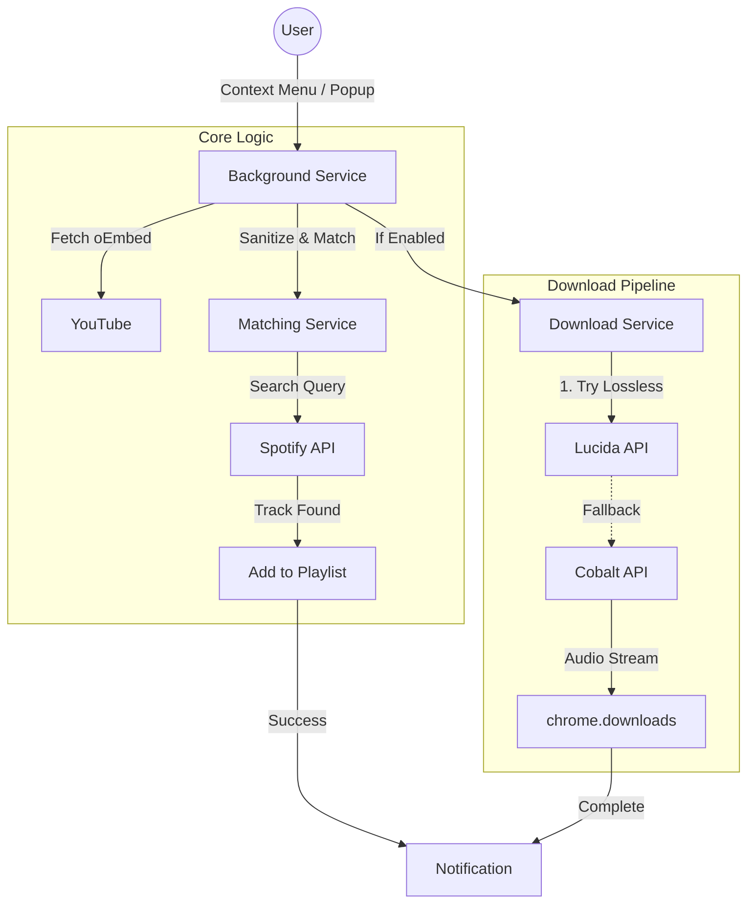

<p align="center">
  <a href="https://github.com/Microck/tuneport">
    
  </a>
</p>

<p align="center">a browser extension that syncs youtube videos to spotify playlists with zero friction.</p>

<p align="center">
  <a href="LICENSE"></a>
  <a href="package.json"></a>
  <a href="tuneport-extension/src/manifest.json"></a>
</p>

<p align="center">
  
</p>

---

## overview

tuneport bridges the gap between youtube's discovery algorithm and spotify's library management. it detects the video you're watching, finds the best match on spotify, and adds it to your chosen playlist with a single click.

unlike other sync tools, tuneport also offers **simultaneous downloads**. it checks lossless sources (qobuz, tidal, deezer) via lucida before falling back to youtube's audio stream, ensuring you always get the highest quality file for your local archive.

## features

-   **instant sync**: right-click any video -> "add to playlist".
-   **smart matching**: uses jaro-winkler fuzzy matching to handle "official video", "lyrics", and "ft." noise.
-   **dual pipeline**: adds to spotify + downloads to disk in parallel.
-   **lossless first**: prioritizes flac from lucida (qobuz/tidal/deezer); falls back to youtube's native opus stream (~128kbps, perceptually equivalent to mp3 320kbps).
-   **duplicate guard**: checks destination playlist before adding to prevent clutter.
-   **privacy**: runs entirely in the browser. no backend server. no data collection.

## quickstart

### manual installation

1.  download the latest `tuneport-github-v*.zip` from [releases](https://github.com/Microck/tuneport/releases).
2.  unzip the archive.
3.  navigate to `chrome://extensions`.
4.  enable **developer mode** (top right toggle).
5.  click **load unpacked** and select the unzipped folder.

### configuration

click the extension icon or access settings via the right-click menu.

-   **default playlist**: set a target to skip the selection menu.
-   **download format**: opus (best quality from youtube), mp3, ogg, or wav. note: youtube serves ~128kbps opus which is perceptually equivalent to mp3 320kbps.
-   **lossless sources**: enable "lucida" in advanced settings for true lossless (flac) from qobuz/tidal/deezer.

## development

### prerequisites

-   node.js 18+
-   npm 8+

### setup

```bash
# clone repository
git clone https://github.com/Microck/tuneport.git
cd tuneport

# install dependencies
npm install

# start dev server (watch mode)
npm run dev
```

load the `tuneport-extension/dist` folder in chrome as an unpacked extension.

### building

```bash
# build for chrome web store (restricted features)
npm run build:webstore

# build for github release (full features)
npm run build:github
```

## architecture



## troubleshooting

**"not authenticated with spotify"**
click the tuneport icon in the toolbar and hit "connect spotify". the token refreshes automatically.

**"download failed"**
ensure the cobalt instance URL in settings is reachable. default: `https://cobalt-api.meowing.de`. alternative instances: `https://cobalt-backend.canine.tools`, `https://kityune.imput.net`.

**"track not found"**
the matching algorithm requires a clean title format (e.g., "Artist - Title"). heavy remix/mashup titles may fail confidence checks.

## technical documentation

for details on youtube's audio infrastructure, codec choices, and why opus ~128kbps rivals mp3 320kbps, see [`docs/report.tex`](docs/report.tex).

## license

mit.
